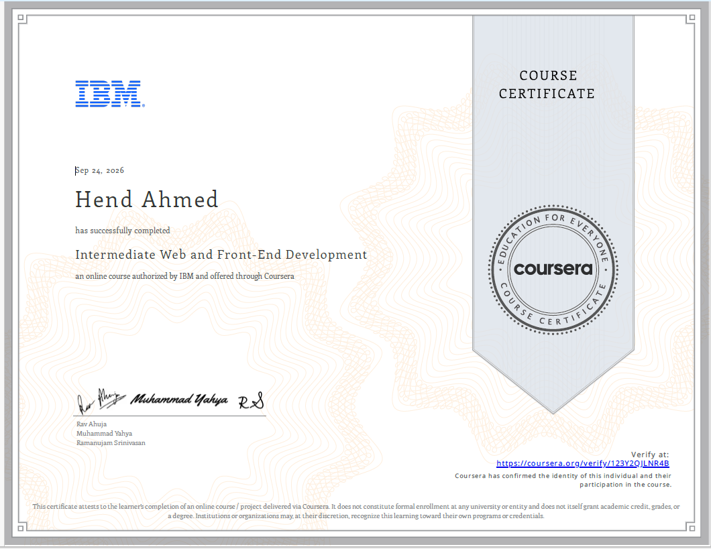

# Intermediate Front-End Web Development | IBM

Completed **IBM’s Intermediate Front-End Web Development** course through **Coursera**.

This course strengthened my understanding of the technologies and concepts involved in building modern web interfaces, with a focus on JavaScript, front-end development practices, testing, debugging, and development tools.

## What I Learned

- Building interactive web pages with JavaScript
- Working with the DOM and browser-based interactions
- JavaScript functions, objects, arrays, and core programming concepts
- Event handling and user interactions
- Reusable components and structured application development
- Front-end development practices and tools
- Testing concepts and the role of testing frameworks
- Debugging techniques and improving front-end code
- Writing structured and maintainable code
- Content Management Systems (CMS) and Search Engine Optimization (SEO), including their types, features, and benefits
- Webpack 5, including its advantages, functions, and role in modern front-end development
- Mocha and Jasmine testing frameworks, including their advantages and disadvantages
- The debugging process, its importance, and different debugging methods

## Key Takeaway

Beyond individual technologies and concepts, this course helped me understand how different front-end skills work together when building and maintaining a modern web application.

It strengthened my foundation in **JavaScript, testing, debugging, and front-end development tools**, which I am continuing to build through hands-on practice and projects.

## Certificate

**Provider:** IBM
**Platform:** Coursera

[View and Verify Certificate](https://coursera.org/share/0df67fc9695b64bb152e8e2b9b159901)

## Certificate Preview

## Certificate File

[View Certificate PDF](certificate.pdf)

---

Thank you to **IBM** and **Coursera** for the learning experience.
