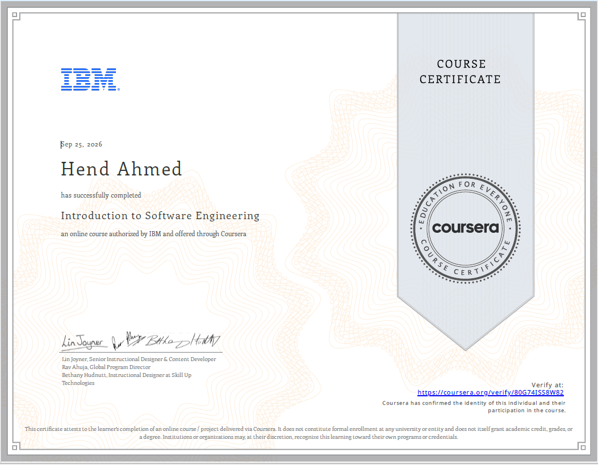

# Introduction to Software Engineering | IBM

Completed **IBM’s Introduction to Software Engineering** course through **Coursera**.

This course provided a broad foundation in software engineering, covering software development principles, the Software Development Life Cycle (SDLC), development methodologies, software architecture, programming fundamentals, version control, deployment patterns, and software engineering roles and career paths.

## What I Learned

- Software engineering as a profession and different career paths
- Software Development Life Cycle (SDLC)
- Agile and other software development methodologies
- Software requirements and software architecture
- Common software architecture and application architecture patterns
- Version control and Git-based development workflows
- Programming fundamentals and object-oriented programming concepts
- Software engineering roles and their responsibilities
- Current software engineering job landscape and expected skills

## Key Takeaway

One of the most valuable aspects of this course was connecting technical concepts with how real software teams **plan, design, develop, test, deploy, and maintain software**.

The course strengthened my understanding of software engineering beyond writing code and gave me a stronger foundation as I continue developing my skills in **front-end and full-stack web development**.

## Certificate

**Provider:** IBM
**Platform:** Coursera

[View and Verify Certificate](https://coursera.org/share/117f23e9d025cd1f0ff20a99385ea6c6)

## Certificate Preview

## Certificate File

[View Certificate PDF](certificate.pdf)

---

Thank you to **IBM** and **Coursera** for providing this learning opportunity.
