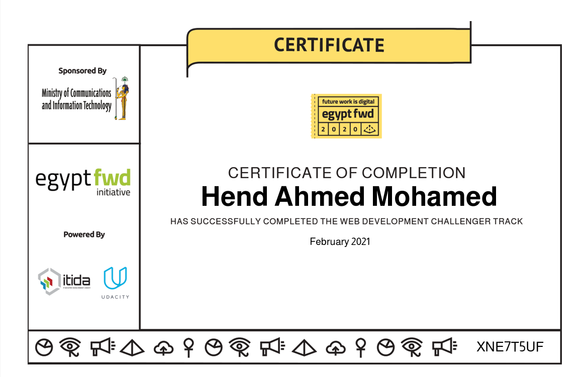

# Web Development Challenger Nanodegree | Udacity

Completed the **Web Development Challenger Nanodegree Program** from **Udacity** in **2021**.

## What I Learned

- HTML fundamentals
- CSS fundamentals
- Responsive Web Design
- Building responsive web pages
- Structuring and styling web content for different screen sizes

## Key Takeaway

This program gave me a practical foundation in **HTML, CSS, and responsive web development**, and helped me understand the fundamentals of building web pages that adapt to different screen sizes.

This foundation became part of my ongoing journey toward **Front-End and Full-Stack Web Development**.

## Certificate

**Provider:** Udacity
**Program:** Web Development Challenger Nanodegree
**Year:** 2021

[View and Verify Certificate](https://www.udacity.com/certificate/e/0fdd4550-4627-11eb-87f0-c30475e786b9)

## Certificate Preview

## Certificate File

[View Certificate PDF](certificate.pdf)
